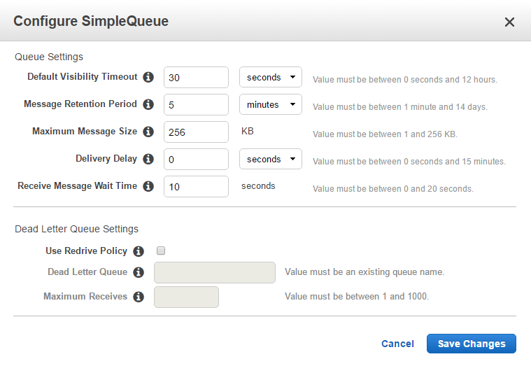

# Configure JCloudScale Lambda

## Step 0: Download your Security Credentials
Login into your Amazon Web Service account, go to [My Security Credentials](https://console.aws.amazon.com/iam/home?#/security_credential), create a new acces key and download the key file.

## Step 1: Set your Security Credentials in JCloudScale Lambda
Download the JCloudScale Lambda project, go to the *src/main/java/ch/uzh/ifi/seal/jcs_lambda/configuration* folder and open the *AwsCredentials.java* file. Set here now your access and secret key from the key file, that you downloaded from AWS.

## Step 2: Install Maven & Java and set the environment variable
If you not already installed [Maven](https://maven.apache.org/download.cgi) and [Java 8 SDK](https://docs.oracle.com/javase/8/docs/technotes/guides/install/install_overview.html), then it is now time.

It is necessary that you set the following environment variable:
+ *JAVA_HOME*
+ *MAVEN_HOME* (or you just set the maven home in the *AwsConfiguration.java* file in *src/main/java/ch/uzh/ifi/seal/jcs_lambda/configuration* file)

## Step 3: Create a role
Login into your Amazon Web Service account, go to the [Identity and Access Management](https://console.aws.amazon.com/iam/home).
+ Choose "Roles" in the menu
+ Use "create new role"
+ Select as role type "AWS Lambda"
+ As role you choose "AWSLambdaFullAccess" and "AmazonSQSFullAccess"
+ After the creation you should save the role ARN for Step 5]

## Step 4: Create a Simple Queue
Login into your Amazon Web Service account, go to the [Simple Queue Service](https://console.aws.amazon.com/sqs/home).

Create a new queue with the exactly following configurations:

After the creation you should save the queue ARN for Step 5

## Step 5: Modify the JCloudScale Lambda settings 
Now open the *AwsConfiguration.java* file in *src/main/java/ch/uzh/ifi/seal/jcs_lambda/configuration* and paste your Role ARN and Queue url into the *AWS_ROLE_ARN* and *AWS_QUEUE_URL* variable.

If you would like to change the default settings from JCS Lambda, then you can change here the following configuarions:

| Variable                      | Description   | 
| -------------                 |:-------------:| 
| *AWS_REGION*                  | AWS infrastructure services are hosted in multiple locations world-wide. These regions are logically isolated from each other. So it is necessary to choose one. A list with all regions can be found [here](http://docs.aws.amazon.com/AWSJavaSDK/latest/javadoc/com/amazonaws/regions/Regions.html) |
| *AWS_TIMEOUT*                 | All calls made to AWS Lambda must complete execution within 300 seconds. The default timeout is 3 seconds, but you can set the timeout to any value between 1 and 300 seconds. |
| *AWS_DEFAULT*                 | In the AWS Lambda resource model, you choose the amount of memory you want for your function, and are allocated proportional CPU power and other resources. Minimum value of 128. Maximum value of 1536. The value must be a multiple of 64 MB |_MEMORY_SIZE
| *AWS_BUCKET_PREFIX*           | Here you can set the prefix for the s3 bucket. This bucket is needed for uploading the jar file. After a successfully initialization phase the bucket will be removed automatically. Normally it's not necessary to modify this parameter. (Should not be longer the 15 characters) |
| *AWS_API_GATEWAY_NAME*        | Here you can set the name of the gateway. Normally it's not necessary to modify this parameter. |
| *AWS_API_GATEWAY_STAGE_NAME*  | Here you can set the name of the gateway stage. Normally it's not necessary to modify this parameter. |
| *AWS_FUNCTION_PREFIX*         | Normally it's not necessary to modify this parameter. (Should not be longer the 15 characters) |
